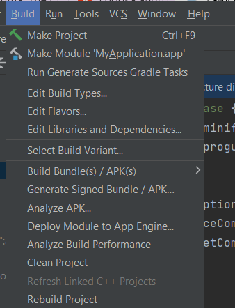

# Инструкция по сборке

1. В Android studio File>open> выбрать путь к папке MyApplication
   

2. build>Generate Signed Bundle / Apk И выбираем сбилдить Apk.
   

3. Далее открывается окно. В котором нам нужно указать путь до keystore на вашем пк, пароль от него и key alias. Если у вас нет keystore - пишем продюсеру.

4. Нажимаем далее и выбираем релизный вариант билда, после чего нажимаем финиш.

5. Когда процесс сборки окончится, в логах появляется сообщение и успешной сборке. Если нажать на locate, в инспекторе откроется папка с билдом
