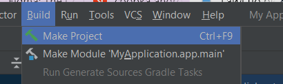

# Инструкция по сборке

## Сборка через CLI
Для сборки APK-файла вашего приложения с помощью интерфейса командной строки выполните следующие шаги:

#### **1. Открытие командной строки**
Запустите **терминал** (Command Prompt, PowerShell или терминал Linux/macOS) и перейдите в корневую папку проекта Android.  
Если вы используете встроенный терминал Android Studio, убедитесь, что он открыт в папке проекта.

#### **2. Сборка APK**
Введите следующую команду для сборки APK-файла в режиме **release** (или **debug**, если подпись не требуется):

**Для сборки дебаг-версии:**
```sh
./gradlew assembleDebug
```
или (в Windows):

```
gradlew assembleDebug
```

После завершения сборки APK-файл будет находиться в директории:  
app/build/outputs/apk/debug/app-debug.apk
## Сборка через интерфейс Android Studio

   
   
  
3. build>Generate Signed Bundle / Apk И выбираем сбилдить Apk.
   
   
  
5. Далее открывается окно. В котором нам нужно указать путь до keystore на вашем пк, пароль от него и key alias. Если у вас нет keystore - пишем продюсеру.
  
6. Нажимаем далее и выбираем релизный вариант билда, после чего нажимаем финиш.
  
7. Когда процесс сборки окончится, в логах появляется сообщение и успешной сборке. Если нажать на locate, в инспекторе откроется папка с билдом
